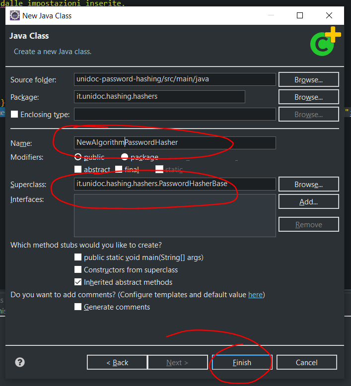
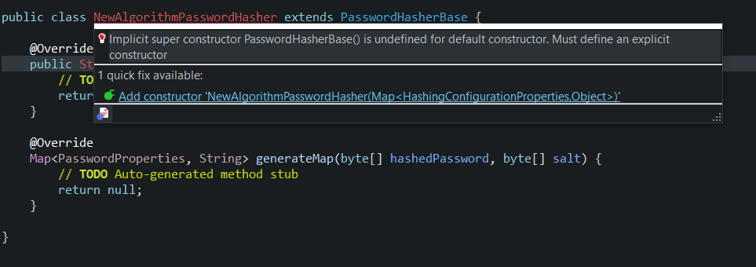
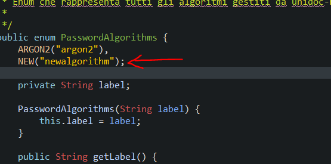
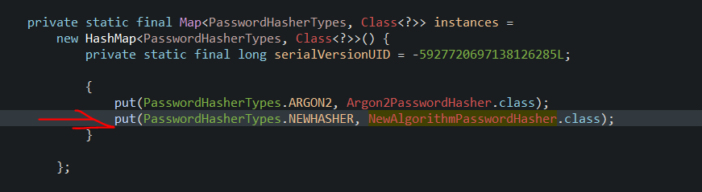
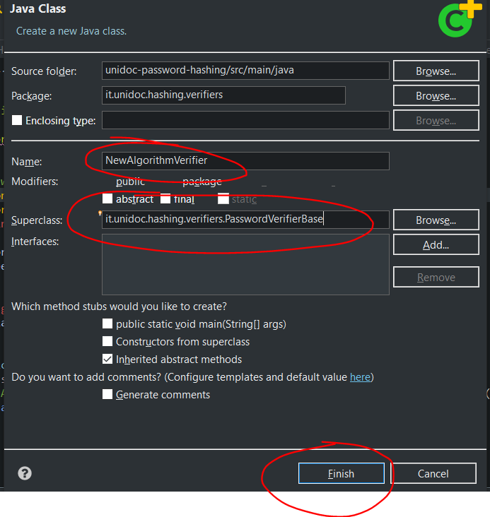
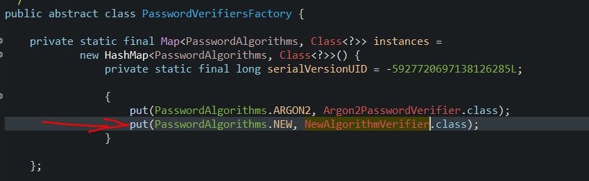

# password-hashing-sdk

Library that exposes features for hashing and password verification.

## Goal

The purpose of the library is to provide unified methods, and customizable through a configuration file, for the password hasshing and the verification of the same.

## How it works

The bookcase is based on the use of [Bouncycastle] (https://www.bouncycastle.org/), which provides, among the many features, also various hashing algorithms.

### The core implementation
In addition to BouncyCastle, a custom management of the string produced by hashing has been integrated, this management was based on how the basic library of Argon2 encodes the result of the hashing.

EX. Use Basic Library of Argon2 Without BouncyCastle:

`$argon2id$v=19$m=4000,t=4,p=4$dGVzdDEyMTI$kQhxSukIUWsT1MG2S8c10H+XNHkTNf0eOrDtrdNQAyY`

This string that allows the algorithm to identify the characteristics with which the password hashing has been produced.

Similarly, a class of utils has been created that produces a similar result, the class in question is`PasswordEncodingUtils`, And the string produced will have the following structure:

`$a=<algoritmo>,$v=<versione>,$m=<memory_cost>,$i=<iterations>,$t=<threads>$<salt+$+password>$`

The class`PasswordEncodingUtils` provides 2 methods:
- `decode(String hashedPassword)` _Method used by the `PasswordVerifier` to extract the properties from the string shown previously._
- `encode(Map<PasswordProperties, String> values)`_Based on the property map, the method generates the string as shown above._

## Library structure
The library can be divided mainly into 2 macrosations:
- Hashing Password
- Verify Password

_**Why such division?**_ The verification of a password is always an operation that depends on the characteristics of the password that you want to verify, the verification of a password must always be carried out with the same parameters with which the hashing has been carried out, a variation would involve in a different result and therefore the verification would always be incorrect. Furthermore, this functionality could be requested in various projects, and each of them may have used several hashing methods, or certain properties may be varied. 

To tire the right verifier it will only be necessary to indicate the string produced by the hashing method, the library will then break this string and extract the necessary information by constantly instantiating the correct verifier.

### Hashing
The fulcrum of hashing functionality is made up of these 3 elements:

- `PasswordHasher` _Interface indicating the basic behaviors of each Hasher._
- `PasswordHasherBase` _Abstract class that implements the `PasswordHasher` interface, this classa must be extended by all the havehers surveyed._
- `PasswordHashersFactory` _Abstract factory that deals with instantiating the `PasswordHasher` requested (or default one)._

### Verification

The fulcrum of the verification function of a password is made up of these 3 elements:
- `PasswordVerifier` _Interface indicating the basic behaviors of each verifier._
- `PasswordVerifierBase` _Abstract class implementing the interface `PasswordVerifier, This class must be extended by all verifiers surveyed._
- `PasswordVerifiersFactory` _Abstract factory that deals with instantiating the `PasswordVerifier` requested.z


## Usage
The library exhibits various classes used for hashing and password verification:

### Hashing Password
To carry out the hashing of a password it will be necessary to use the class `PasswordHashersFactory`, this class exposes different methods:
- `getDefaultInstance()` _Allows you to create an instance of the interface`PasswordHasher` starting from the default properties in the file  `security-default.properties`_
- `getInstance(PasswordAlgorithms passwordHasher)` _Allows you to create an instance of a `PasswordHasher` Based on the algorithm specified in the parameter of the method, The Created Hasher will have as its property, those of default of the type of specified Hasher._
- `getInstance(Map<PasswordHashingProperties, Object> hashingProperties)` _Allows you to create an instance of the interface `PasswordHasher` based on the map of ownership specified in the parameter of the method._
- `getInstance(PasswordAlgorithms passwordHasher, Map<PasswordHashingProperties, Object> hashingProperties)` _Allows you to create an instance of the interface `PasswordHasher` based on the type of hasher specified, setting the properties specified on the map of the method parameter_


Once you use one of the methods, `PasswordHashingFactory` will return an instance of the interface `PasswordHasher` che esporrà il metodo `hash(String userPassword)`,who will return a string indicating the hash of the password and the properties with which it was carried out. 

**CODE EXAMPLE:**
```
PasswordHasher passwordHasher = PasswordHashersFactory.getDefaultInstance();
String result = passwordHasher.hash("123456789");
```

### Password Verification

To carry out a password it will be necessary to use the `PasswordVerifiersFactory` class, this class exposes the following method:
- `getInstance(String hashedPassword)` _It allows you to create an instance of an `PasswordVerifier` it will extract the properties with which the password hashing was carried out by the string present in the DB_ 

**CODE EXAMPLE:**
```
PasswordVerifier passwordVerifier = PasswordVerifiersFactory.getInstance(hashedPassword);
Boolean isMatching = passwordVerifier.verify("123456789", hashedPassword);
```

## Add new hasher
If you want to add support to a new hashing algorithm it will be necessary to follow these steps:

1. Create a new Class that extends `PasswordHasherBase` in the package it.creativeraccoon.password.hashing.sdk.hashers



2. Implement the class as suggested by the IDE



3. Add the new Hasher algorithm in the ENUM `PasswordAlgorithms`



4. Add the new hasher in the class `PasswordHashersFactory`



Now the new Hasher will be usable both by code as explained in the previous sections, and using the configuration files indicating the label specified in `passwordalgorithms' as an algorithm.

** When a new Hasher is added you need to create a new verifier **. To create a verifier the steps are identical to those for the creation of a hasher:
1. Create a class that extends `` truthful basic passwords' in the it.creativeraccoon.password.hashing.sdk.verifiers



4. Add the new Hasher to the `PasswordVerifiersfactory` class


